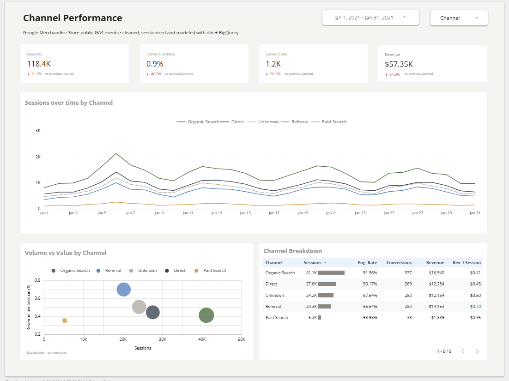
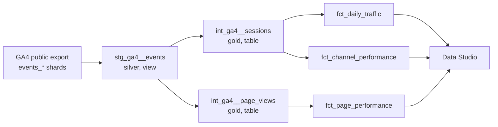

# GA4 Channel Performance Pipeline

Raw Google Analytics 4 events, modeled in **dbt** on **BigQuery**, served in a **Data Studio** dashboard.

The dashboard was built for monitoring channel performance: *which channels drive volume, and which drive value?*

**[Open the live dashboard](https://datastudio.google.com/reporting/8f5a9e4d-9ed6-4d73-8f47-fdd3b1610782)**



---

## How the data flows



| Layer | Model | Grain | Materialization |
|---|---|---|---|
| Bronze | `bigquery-public-data.ga4_obfuscated_sample_ecommerce.events_*` | Event, nested | Read in place |
| Silver | `stg_ga4__events` | Event, flattened | View |
| Gold | `int_ga4__sessions` | Session | Table, clustered |
| Gold | `int_ga4__page_views` | Session x page | Table, clustered |
| Gold | `fct_daily_traffic` | Date x channel | Table, clustered |
| Gold | `fct_channel_performance` | Date x channel x source x medium | Table, clustered |
| Gold | `fct_page_performance` | Date x page | Table, clustered |

---

## Design decisions

**Silver (staging)**
- Flattens `event_params` with scalar subqueries, so row counts match the source (no `cross join unnest` fan-out).
- Nulls GA4 placeholder values: `(not set)`, `<Other>`, `(data deleted)`. Keeps `(none)`, the real medium for direct traffic.
- Deduplicates on user, timestamp, event name and full event params. The sample had 0 duplicates; the step stays as a safeguard for live exports.
- Explicit column list where data enters the model, not `select *`.

**Gold (sessions and marts)**
- Session key is `user_pseudo_id` + `ga_session_id`. The session ID alone is not unique across users.
- Engagement time per page comes from GA4's `engagement_time_msec`, so exit pages get time too.
- Marts store counts next to every rate (`engaged_sessions`, `converting_sessions`). The dashboard divides summed counts, so rates stay correct for any date range.
- Channel logic lives in one macro, `channel_grouping(source_col, medium_col)`, used by every mart.
- Conversion events and the date range are dbt vars, so a new source is a config change, not a rewrite.
- Tables are clustered on date instead of partitioned. The BigQuery sandbox expires partitions 60 days after the partition date, which drops historical data on write.

**Naming**
- `first_user_source` / `first_user_medium`, not `source` / `medium`. This dataset only carries first-touch attribution, and the names say so.
- Unit suffixes on every measure: `_msec`, `_secs`, `_usd`, `_utc`.

---

## Run it

**Prerequisites:** Python 3.9+, a GCP project (the free BigQuery sandbox works), a service account with `BigQuery Data Editor` and `BigQuery Job User`.

```bash
pip install dbt-bigquery
```

Add a profile at `~/.dbt/profiles.yml` (kept outside the repo):

```yaml
ga4_pipeline:
  target: dev
  outputs:
    dev:
      type: bigquery
      method: service-account
      project: your-gcp-project
      dataset: dbt_dev
      keyfile: /path/to/service-account-key.json
      location: US
      threads: 4
```

Then:

```bash
cd dbt_project
dbt debug   # check the connection
dbt run     # build silver and gold
```

Build a different date range without editing code:

```bash
dbt run --vars "{start_date: 20201201, end_date: 20201207}"
```

Models land in `dbt_dev_silver` and `dbt_dev_gold`.

---

## Project structure

```
dbt_project/
├── dbt_project.yml          vars, materializations, schemas
├── macros/
│   └── channel_grouping.sql
└── models/
    ├── staging/             silver
    │   ├── _staging__sources.yml
    │   └── stg_ga4__events.sql
    ├── intermediate/        gold building blocks
    │   ├── int_ga4__sessions.sql
    │   └── int_ga4__page_views.sql
    └── marts/               gold, dashboard-facing
        ├── fct_daily_traffic.sql
        ├── fct_channel_performance.sql
        └── fct_page_performance.sql
```

---

## Checks

Run after each build:

- Grain: row count equals distinct key count in every intermediate model.
- Reconciliation: mart totals for sessions, revenue and page views match the intermediate tables.
- Dashboard: scorecards for Jan 2021 match the same query in BigQuery.

---

## Known limitations

- **Sample data.** Google's public GA4 export covers Nov 2020 to Jan 2021, and about a fifth of source/medium values are obfuscated. Those show as **Unknown**, not as Direct.
- **First-touch only.** Channels are the user's acquisition channel, not the session's.
- **Users are daily counts.** Summed across days they overcount returning visitors.
- **Sandbox expiry.** Tables expire 60 days after creation. Rerun `dbt run` to restore them.

---

**Stack:** BigQuery · dbt Core · Data Studio · Python
